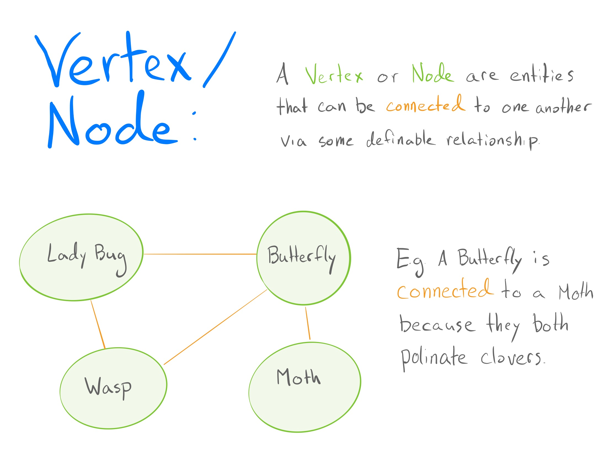
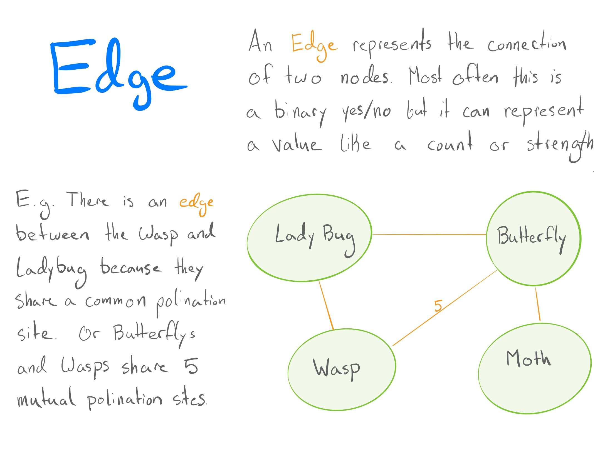
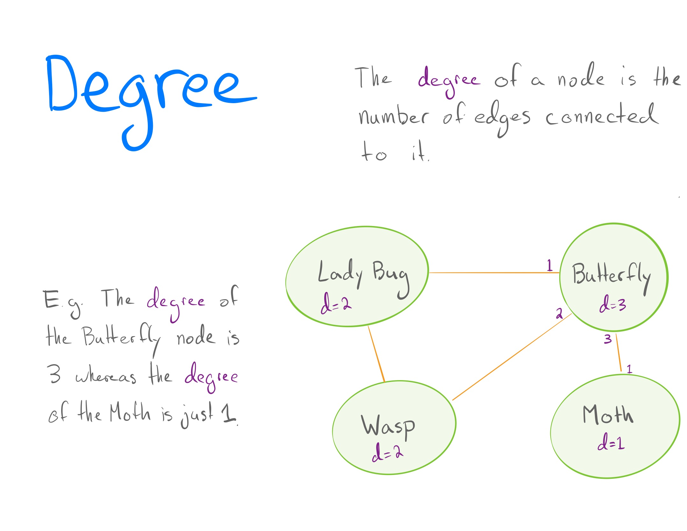
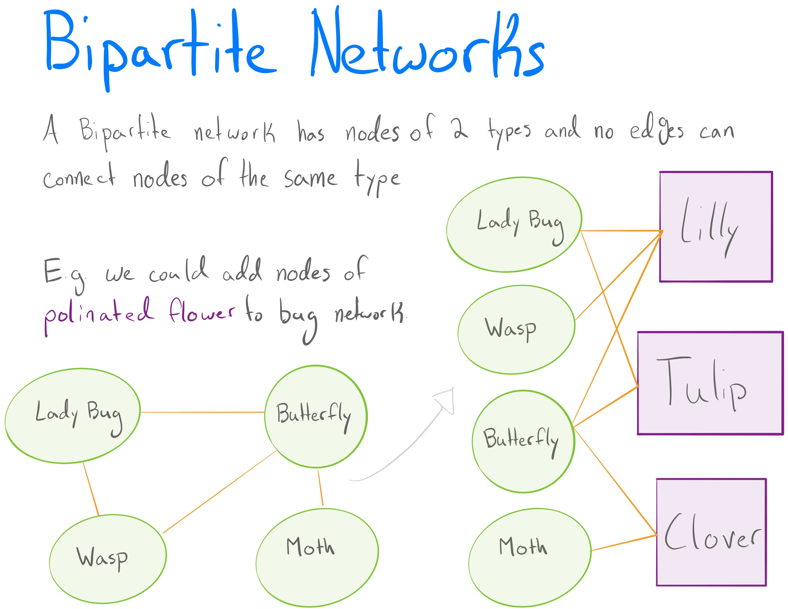
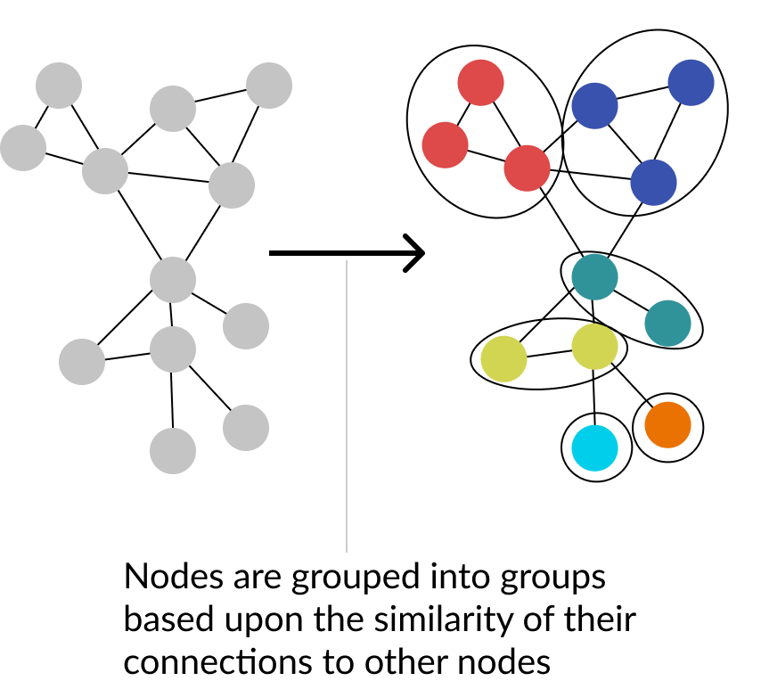

```{r setup, include=FALSE}
options(htmltools.dir.version = FALSE)
```


## Presentation Layout

- Network Refresher
  - Vertex/Nodes
  - Edges
  - Degree
  - Bipartite networks
- What are they trying to do?
- Why are they trying to do it?
- The "old" ways
- The SBM
- Degree Correction
  - Why
  - How
- The BiSBM
- Results
  - Simulated data
  - Real data
- My thoughts
---

class: center, middle

# Network Refresher

---

class: middle




---

class: middle




---

class: middle




---

class: middle




---

# What are they trying to do?

![:space 7]

> This bipartite stochastic block model yields a projection-free and statistically principled method for community detection that makes clear assumptions and parameter choices and yields interpretable results.

![:space 10]

Build a model for detecting communities of nodes that...
- doesn't need to project data to unipartite structure
- is statistically 'principled'
- and is interpretable

---

# Why are they trying to do it?

No projections: 
> Using projections creates both practical and principled issues... tend to inflate measures such as assortativity and the clustering coefficient... loss of information... projection of a highly structured bipartite network can appear unstructured

![:space 5]

Statistically Principled and interpretable:
> [Non-SBM attempts] express implicit modeling restrictions and assumptions in their output... Stochastic block models have the advantage of explicitly stating the underlying assumptions, which improves the interpretability of the results.


---

class: middle

# The "old" ways

- Project bipartite network into a unipartite one and cluster on that
- Cluster on the bipartite network using matrix decomposition methods
- Use complex and black-box optimization methods


---


# The SBM

- Models the community structure of nodes by collapsing them into blocks
- Defines a probability distribution over all possible community forms
  - Therefor is a 'generative' model



---

# Degree Correction


---

## Why


---

## How


---

# The BiSBM


---

# Results


---

## Simulated data


---

## Real data


---

# My thoughts