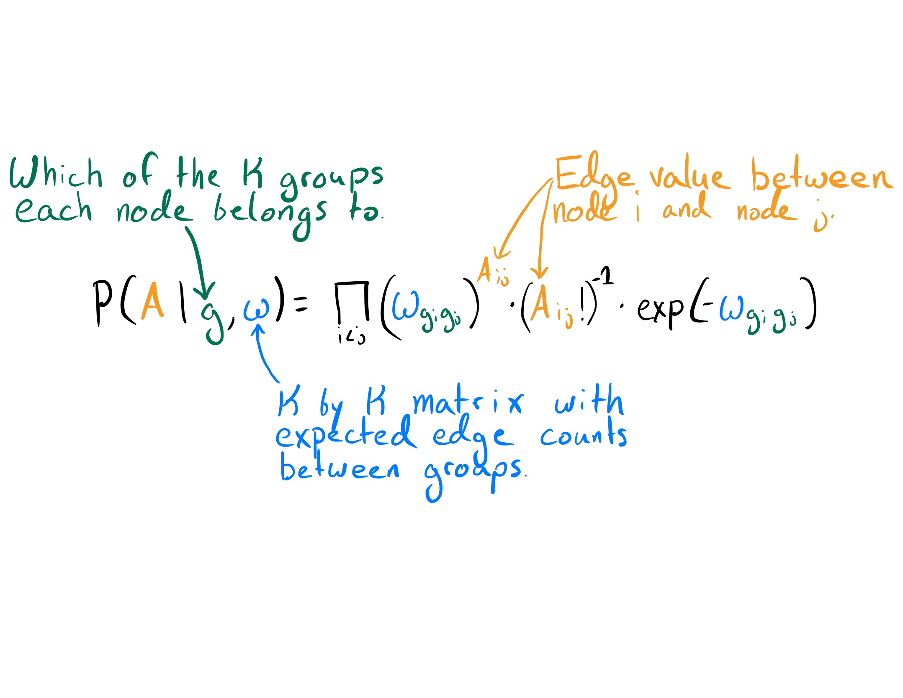
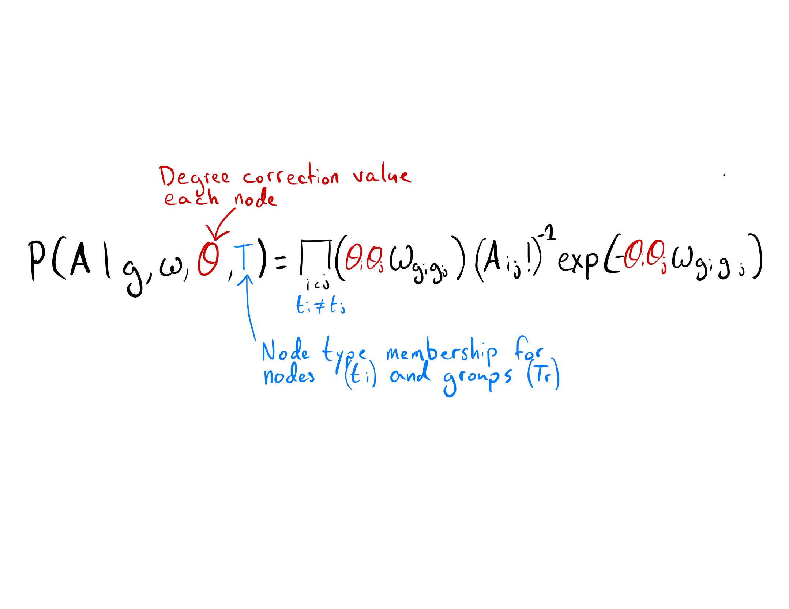

```{r setup, include=FALSE}
options(htmltools.dir.version = FALSE)
```


## Presentation Layout

- Network Refresher
  - Vertex/Nodes
  - Edges
  - Degree
  - Bipartite networks
- What are they trying to do?
- Why are they trying to do it?
- The "old" ways
- The SBM
  - Formula
- Degree Correction
  - Why
  - How
- The BiSBM
  - About
  - Formula
  - Fitting it
- Results
  - Simulated data
  - Real data
- My thoughts
---

class: center, middle

# Network Refresher

---

class: middle


---

class: middle


---

class: middle


---

class: middle


---

# What are they trying to do?

![:space 7]

> This bipartite stochastic block model yields a projection-free and statistically principled method for community detection that makes clear assumptions and parameter choices and yields interpretable results.

![:space 10]

Build a model for detecting communities of nodes that...
- doesn't need to project data to unipartite structure
- is statistically 'principled'
- and is interpretable

---

# Why are they trying to do it?

No projections: 
> Using projections creates both practical and principled issues... tend to inflate measures such as assortativity and the clustering coefficient... loss of information... projection of a highly structured bipartite network can appear unstructured

![:space 5]

Statistically Principled and interpretable:
> [Non-SBM attempts] express implicit modeling restrictions and assumptions in their output... Stochastic block models have the advantage of explicitly stating the underlying assumptions, which improves the interpretability of the results.


---

class: middle

# The "old" ways

- Project bipartite network into a unipartite one and cluster on that
- Cluster on the bipartite network using matrix decomposition methods
- Use complex and black-box optimization methods


---


# The SBM

- Models the community structure of nodes by collapsing them into blocks
- Defines a probability distribution over all possible community forms
  - Therefor is a 'generative' model


---

class: middle

## SBM formulation





---

# Degree Correction


![:space 1]


### Why

Looking just at the average number of connections between groups means the model will cluster popular nodes with each other. This means a node that is noisey but popular can mess stuff up.

![:space 8]


### How

Introduce a new parameter $\theta_i$ which controls the expected degree of each node. Thus changing the $\lambda$ of the Poisson from $\omega_{i,j}$ to $\theta_i\theta_j\omega_{i,j}$.


---

# The BiSBM

### How
By not letting the SBM place nodes of the same type in a cluster together we force it to take a bipartite form. 


### What changes
$k$ groups $\to$ $k_a$ and $k_b$ groups.

Full $\omega$ matrix $\to$ block matrix with upper right partition $B$: $(k_a \times k_b)$


### What doesn't change

This structure forcing amounts to an infinitely strong prior of group membership between clusters. So posterior is effectively the same.

---

## BiSBM formulation




---

## How it's fit

![:space 3]


1. Assign a random group to all nodes
2. Take node $i$ and move it to another group of the same type and record posterior probability
3. Repeat step 2 for every available group of the same type
4. Repeat steps 2 and 3 for every node in the network
5. Choose move that yielded the best posterior prob (this may be a decline) and change group assignments accordingly
6. Repeat steps 2 through 5 until convergence

![:space 8]

> The algorithm should be run many times and the highest score from among these independent replicates selected.


---

# Results


---

## Simulated data


---

## Real data


---

# My thoughts

